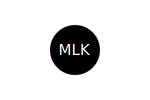

# **Logo Generator** 

I created this project to help others create a simple logo by answering a few quick questions. Utilize node in your terminal to answer a few questions regarding the logo, and a new SVG file will be created based on user input. The SVG file will contain your created logo, which you can utilize in any project you may need it.

#**Table of Contents** <ul><li>[Features](#features)</li><li>[Installation](#installation)</li><li>[Usage](#usage)</li><li>[Technology](#technology)</li><li>[Tests](#test)</li><li>[Credits](#credits)</li><li>[Contribute](#contribute)</li><li>[Questions](#questions)</li><li>[License](#license)</li>

# **Features**

This application utilizes inquirer to create a simple command prompt interface for creating a logo inside an SVG file.

# **Installation**

To run this application, clone a copy onto your pc by entering the following command in your terminal of choice:

<strong> git clone git@github.com:Essence1987/logos.git</strong>
 
Once the repo is copied to your device, ensure your terminal is pointing at the cloned repos directory and enter the following command:

 <strong>node index.js</strong>

# **Usage**

The following image shows a mock-up of the generated SVG given the following input entered by the user: `SVG` for the text, `white` for the text color, `circle` from the list of shapes, and `black` for the shape color. Note that this is just an image of the output SVG and not the SVG file itself:

For a demonstration, please watch the following video:

https://github.com/Essence1987/logos/assets/129245370/258125e9-d815-4098-afec-2a669e924604

# **Technology**

-NPM
-Inquirer
-JEST

# **Test**

To run tests on this application, enter the following command into the terminal: 
 <strong>nxt jest</strong>
  If you would like to create your tests you can edit the shapes.test.js file with your updated testing parameters and then run the command.

For a demonstration, please watch the following video:

# **Credits**

This was a solo project with no contributors taking part.

# **Contribute**

This is a personal project, and I am not currently accepting Contributions. However, if you wish to reach me for further projects, please message me at hwmelander@gmail.com.

# **Questions**

Click the image below to go to my GitHub page!

My email is hwmelander@gmail.com

# **License**

Logo Generator is released under . Click on the badge for more information.
